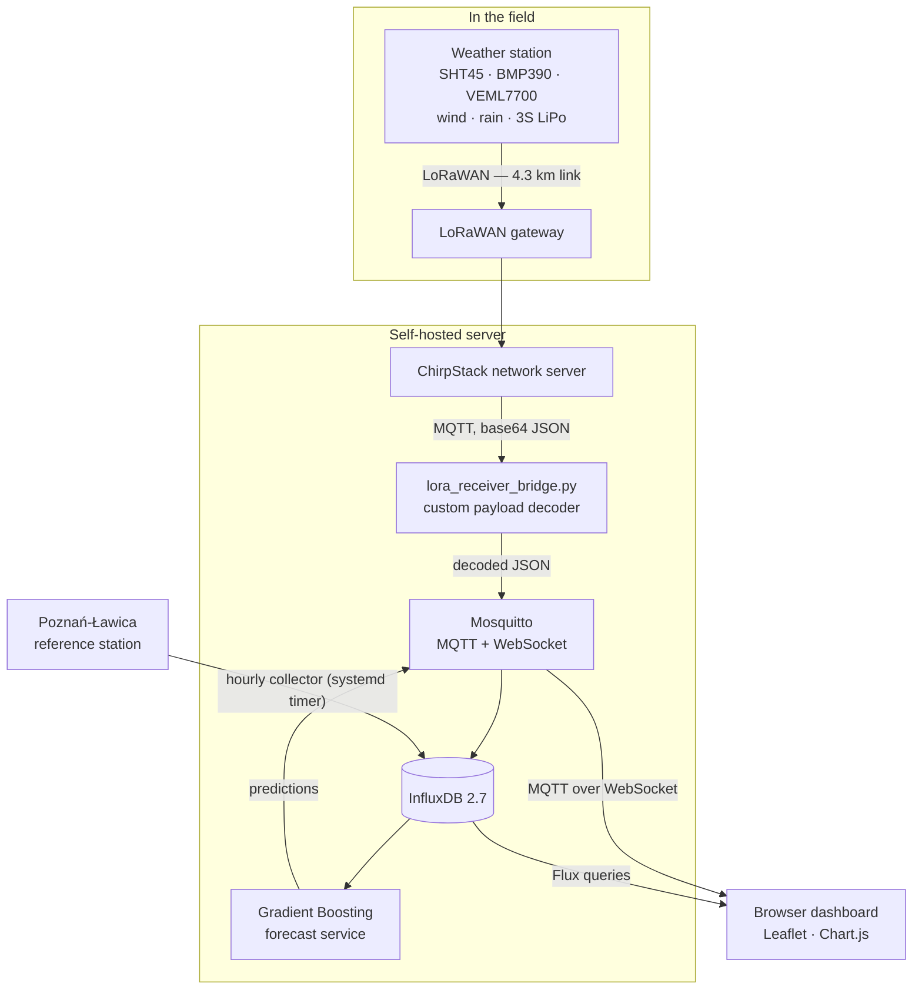
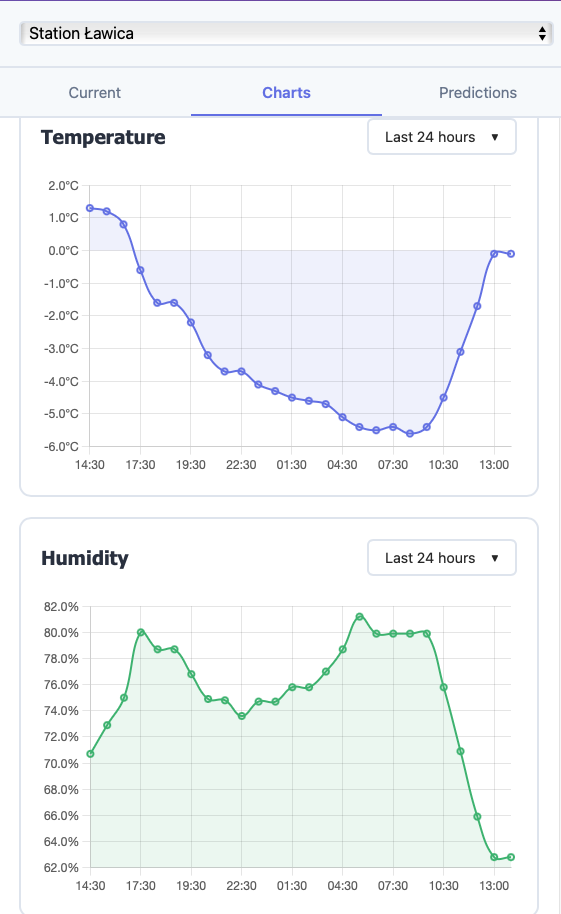

# Autonomous Remote Monitoring System

An autonomous, solar-powered weather station that sends sensor data over LoRaWAN to a self-hosted server, where a Python pipeline decodes, stores and visualises it in real time.

## Context

B.Eng. thesis project at Poznań University of Technology, built by a **team of two**:

| | |
|---|---|
| **Jakub Wesołowski** (this repository) | Software and data layer: LoRa payload decoder, MQTT/InfluxDB pipeline, Python services, Docker deployment, web dashboard, forecasting models |
| **Stanisław Zalewski** | Hardware: PCB design, firmware, power and energy management |

This repository contains the **server-side software only**. The station's firmware and hardware design are not part of it.

## What it does

A station in the field wakes up on a schedule and transmits compact binary packets over LoRaWAN. Each packet type carries a different group of measurements:

| Packet | Interval | Contents |
|---|---|---|
| `0x01` | 6 h | 3S LiPo cell voltages, pack temperatures (BMS / charger side) |
| `0x02` | 5 min | SHT45 temperature and humidity, BMP390 temperature |
| `0x11` | 6 h | Power-module diagnostics (format not fully documented — logged raw) |
| `0x12` | 10 min | VEML7700 illuminance and white ratio, BMP390 pressure |
| `0x22` | 15 min | Wind speed (15-min average), precipitation, two analog tick counters |
| `0x32`–`0xF2` | on demand | "Sudden" single-value events |

A gateway forwards the packets to **ChirpStack**, which publishes them as base64 JSON over MQTT. A Python bridge decodes the binary payload field by field (signed 16-bit values where temperatures may be negative), republishes clean JSON on a local broker and writes points into **InfluxDB**. A browser dashboard subscribes to the same broker over WebSocket, so readings appear without a page reload.

Alongside the LoRa station, an hourly collector pulls official measurements from the Poznań-Ławica (EPPO) airport station, which gives a reference series next to the station's own data.

## Architecture



### Design decisions

- **Decoding on the server, not on the node.** Payloads stay a few bytes wide, which keeps airtime and power consumption low; all interpretation happens in one Python module that is easy to change without touching deployed firmware.
- **MQTT as the single backbone.** The decoder, the database writer, the forecast service and the browser all speak MQTT, so a new consumer is just another subscriber. The dashboard uses MQTT over WebSocket for live values and queries InfluxDB directly for history.
- **Time-series database rather than SQL.** Retention and downsampling of irregular sensor data come for free.
- **Everything containerised.** Mosquitto, InfluxDB and Grafana run from one `docker-compose.yml`; the Python services run under systemd.

## Dashboard

Bilingual (EN/PL), with a map of stations, current readings, history charts and forecasts.



## Forecasting

Three `GradientBoostingRegressor` models (temperature, pressure, humidity) trained on one year of hourly data from the reference station, with 166 engineered features: lags (1/3/6/12/24 h), deltas over the same spans, rolling statistics and calendar/cyclical encodings. A rolling-window script extends single-step predictions out to 48 h.

> **Known limitations — evaluation.** Evaluation of the forecasting model is being reworked (target leakage identified in the original feature set). The published error figures from the thesis are therefore not reproduced here, and no accuracy claim is made until the feature set and the evaluation protocol have been rebuilt.

## Tech stack

**Python** (paho-mqtt, influxdb-client, pandas, scikit-learn, joblib) · **Mosquitto** · **InfluxDB 2.7** · **Grafana** · **Docker Compose** · **systemd** · **JavaScript** (MQTT.js, Leaflet, Chart.js) · **Nginx** and **Cloudflare** in front of the server

## Repository layout

```
lora_receiver_bridge.py    # ChirpStack → decode → local MQTT (+ InfluxDB)
lora_receiver.py           # LoRa receiver variant writing straight to InfluxDB
mqtt_real_station.py       # single-station ChirpStack subscriber
mqtt_to_influxdb.py        # MQTT → InfluxDB writer
data_emulator.py           # synthetic stations, for development without hardware
imgw_meteo_collector.py    # reference-station collector (hourly)
meteo_collector.py         # meteostat-based collector
meteo_historical_import.py # one-off historical backfill
ml/train_models.py         # trains the three Gradient Boosting models
ml/predict_weather.py      # single-step prediction
ml/predict_multi_step.py   # rolling-window forecast, 1–48 h
ml/predict_and_publish.py  # scheduled prediction → MQTT
webapp/                    # dashboard (HTML/CSS/JS, EN + PL)
mosquitto/config/          # broker configuration
deploy/                    # systemd unit + timer for the hourly collector
docker-compose.yml         # Mosquitto + InfluxDB + Grafana
```

## Running it

```bash
git clone https://github.com/kubuswes2003/autonomous-remote-monitoring-system.git
cd autonomous-remote-monitoring-system

cp .env.example .env        # fill in broker/InfluxDB credentials
docker compose up -d        # Mosquitto, InfluxDB, Grafana

pip install -r requirements.txt
python data_emulator.py     # synthetic data, no hardware needed
python mqtt_to_influxdb.py  # MQTT → InfluxDB
```

Then serve `webapp/` with any static file server and open it in a browser.

To ingest from real hardware instead of the emulator, set the ChirpStack broker variables in `.env` and run `lora_receiver_bridge.py`. All configuration is read from environment variables; no credentials are stored in the code.

## Results

- End-to-end pipeline running continuously on a self-hosted server: LoRaWAN → ChirpStack → MQTT → InfluxDB → live dashboard.
- **A 4.3 km LoRaWAN link verified in field tests** between the station and the gateway.
- Live and historical data for the LoRa station, three emulated stations and the official reference station in one interface.

## Limitations and what I would improve

- **Forecast evaluation is invalid** and is being rebuilt (see above); the feature-engineering script and the training dataset are not in this repository, so training cannot be reproduced from it as it stands.
- **Deployment configuration is not included.** The Nginx reverse proxy (basic auth, rate limiting) and the Cloudflare setup live on the server and are not part of this repository.
- **The dashboard queries InfluxDB directly from the browser**, so a read token sits in client-side JavaScript behind the reverse proxy. A small read-only backend endpoint would be the right fix.
- Several receiver scripts overlap (`lora_receiver.py`, `lora_receiver_bridge.py`, `mqtt_real_station.py`); they grew during development and should be merged into one configurable service.
- Packet type `0x11` is only logged raw, since its layout was never fully documented.
- No automated tests, and no retry/backoff around the MQTT and InfluxDB clients.
- Code comments and log messages are in Polish.
